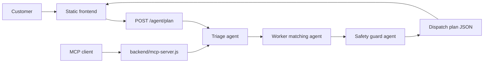

# WorkNet AI Dispatch Agent

WorkNet is a home-services marketplace demo for the Kaggle AI Agents Intensive capstone. It helps a customer describe a repair, cleaning, plumbing, or electrical problem, then uses a small multi-agent workflow to triage the issue, rank nearby workers, and generate safe dispatch next steps.

## Capstone Track

Concierge Agents

WorkNet focuses on an everyday household workflow: getting trusted help quickly while reducing unsafe self-troubleshooting during urgent repairs.

## What It Demonstrates

- Agent / multi-agent system: `backend/agents/worknetAgent.js` contains triage, worker-matching, and safety-review agents.
- MCP server: `backend/mcp-server.js` exposes the dispatch planner as a `worknet_dispatch_plan` MCP-style stdio tool.
- Security features: request validation, output escaping, CORS allow-listing, session cookies, no checked-in secrets, and simple rate limiting.
- Deployability: `render.yaml` deploys the Node app and serves the frontend as static files from the same service.
- Agent skills: the planner turns customer intent into concrete tool-like dispatch actions.

## Architecture



## Local Setup

```bash
cd backend
npm install
npm test
npm start
```

Open `http://localhost:5000` after the server starts. The backend serves the files in `frontend/`, so no separate frontend server is required.

## Useful Commands

```bash
cd backend
npm test
npm run mcp
```

Example API call:

```bash
curl -X POST http://localhost:5000/agent/plan \
  -H "Content-Type: application/json" \
  -d "{\"issue\":\"Water is leaking near the switch board\",\"address\":\"Indiranagar, Bengaluru\"}"
```

Example MCP call:

```json
{"jsonrpc":"2.0","id":1,"method":"tools/list","params":{}}
```

## Environment

Copy `backend/.env.example` when configuring OAuth or MongoDB. The app works without MongoDB by using in-memory bookings for demos.

Required for production hardening:

- `SESSION_SECRET`
- `FRONTEND_ORIGIN`
- `MONGO_URI` if persistent booking storage is needed
- Google/Apple OAuth variables only if social login is enabled

## Submission Assets

- Kaggle writeup draft: `docs/KAGGLE_WRITEUP.md`
- Video script: `docs/VIDEO_SCRIPT.md`
- Submission checklist: `docs/SUBMISSION_CHECKLIST.md`

Do not include API keys, OAuth secrets, database credentials, or private URLs in the public repository.
