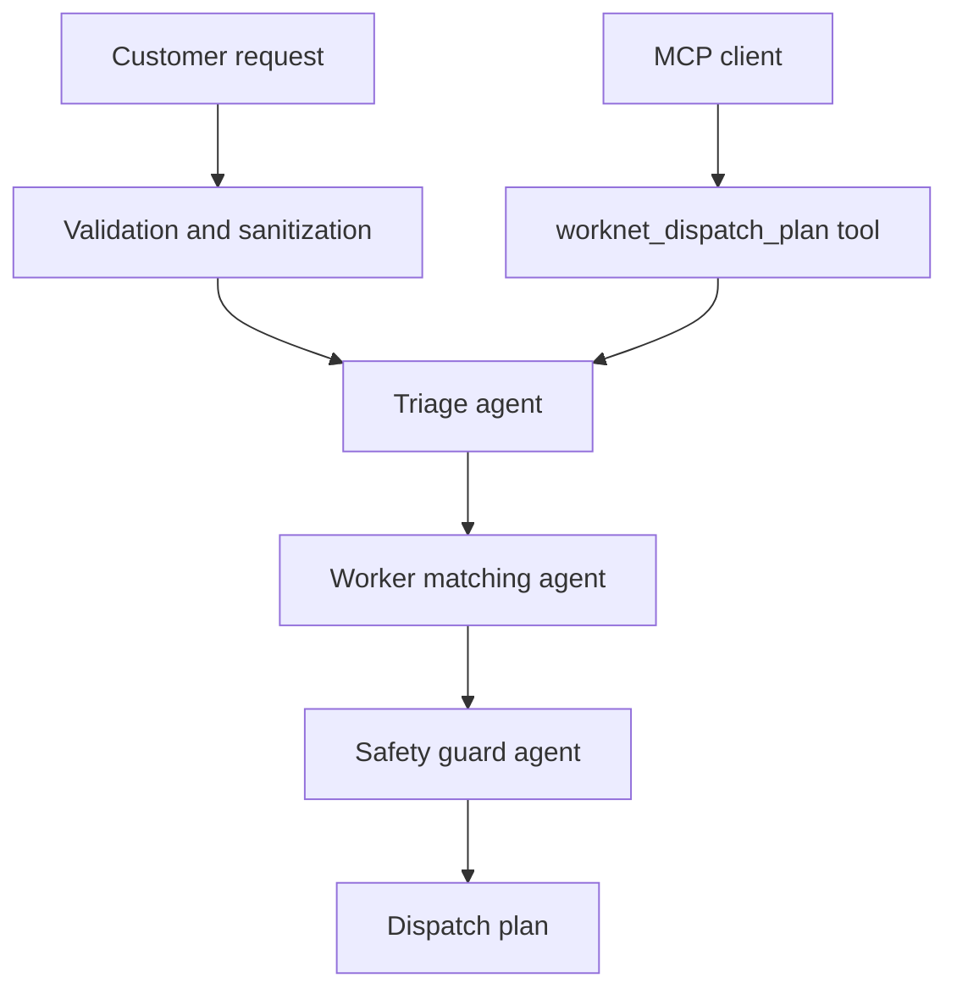

# WorkNet AI Dispatch Agent

## Subtitle

A concierge agent that turns urgent home-service requests into safe, ranked dispatch plans.

## Track

Concierge Agents

## Problem

When a home repair problem happens, people often do not know what type of worker they need, how urgent the issue is, or what safety steps they should take before help arrives. This is especially risky for electrical faults, leaks, and appliance failures. A normal booking form asks the customer to choose a category manually, but the customer may not describe the problem in operational terms.

## Solution

WorkNet adds an AI dispatch agent to a service marketplace. The customer describes the problem and address. The agent workflow then:

1. Classifies the issue into a service category.
2. Detects urgency and risk.
3. Ranks available workers by category, skills, rating, distance, and ETA.
4. Adds safety guard guidance for high-risk situations.
5. Produces concrete next actions for the booking flow.

The current demo is deterministic, so judges can run it without private model keys. It is designed so a production LLM can later be added as a reasoning layer while keeping the same safety and validation boundaries.

## Why Agents

The workflow is not just a single prediction. It requires multiple decisions: understanding the customer's language, matching that intent to worker capabilities, and applying safety rules before dispatch. Separating the logic into triage, matching, and safety-review agents makes the behavior inspectable and easier to test.

## Architecture

## Key Concepts Demonstrated

- Agent / multi-agent system: `backend/agents/worknetAgent.js`
- MCP server: `backend/mcp-server.js`
- Security features: validation, output escaping, CORS allow-listing, rate limiting, no secrets in code
- Deployability: `render.yaml` deploys the backend and static frontend together
- Agent skills: converting an unstructured service request into an operational dispatch plan

## Implementation

The backend is an Express service. It exposes marketplace, booking, authentication, and agent routes. The new `/agent/plan` route validates the request, runs the dispatch workflow, and returns JSON that the homepage renders as triage, recommended team, safety guard, and next actions.

The MCP server runs over stdio and exposes the same planner as `worknet_dispatch_plan`, allowing agent clients to call WorkNet as a tool.

## Security

The project avoids checked-in secrets. Requests are bounded by field length validation. The frontend escapes agent output before rendering. CORS defaults to local development origins and can be configured through `FRONTEND_ORIGIN`. A simple IP-based rate limiter protects the public demo from accidental abuse.

## Demo Flow

1. Open the WorkNet homepage.
2. Use the AI Dispatch Agent panel.
3. Submit a request such as: “Water is leaking fast from the kitchen pipe and spreading near the switch board.”
4. Review the category, risk level, lead worker, team ranking, safety notes, and next actions.
5. Continue to the booking flow.

## What I Would Improve Next

I would connect the deterministic agent policy to a Gemini-powered reasoning layer, add persistent worker availability, add geocoding for distance scoring, and include human approval for all high-risk dispatches before final confirmation.
